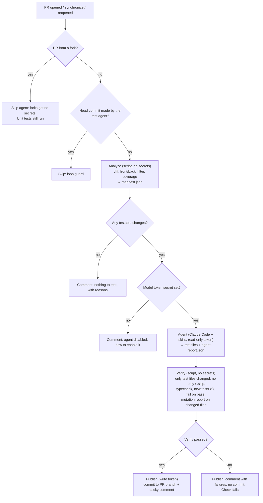
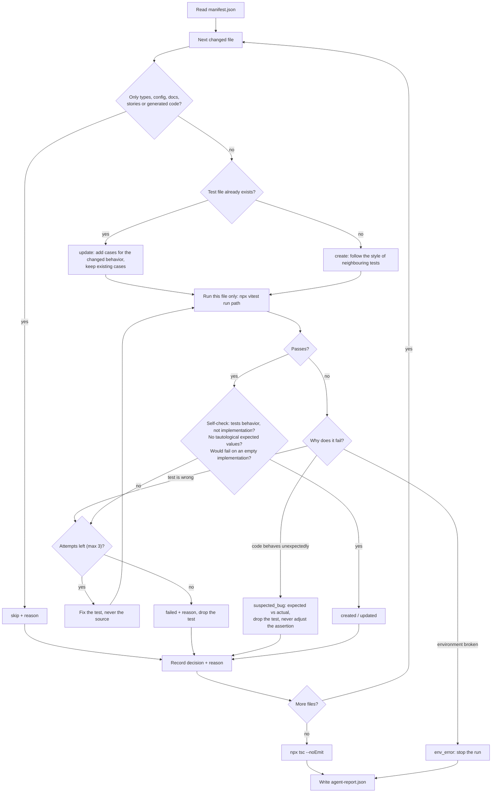

# Unit Test Agent: solution notes

## PR workflow

```mermaid
flowchart TD
  A["PR opened / synchronize / reopened"] --> B{"PR from a fork?"}
  B -- yes --> Z1["Skip agent: forks get no secrets.<br/>Unit tests still run"]
  B -- no --> C{"Head commit made by the test agent?"}
  C -- yes --> Z2["Skip: loop guard"]
  C -- no --> D["Analyze (script, no secrets)<br/>diff, front/back, filter, coverage<br/>→ manifest.json"]
  D --> E{"Any testable changes?"}
  E -- no --> Z3["Comment: nothing to test, with reasons"]
  E -- yes --> F{"Model token secret set?"}
  F -- no --> Z4["Comment: agent disabled, how to enable it"]
  F -- yes --> G["Agent (Claude Code + skills, read-only token)<br/>→ test files + agent-report.json"]
  G --> H["Verify (script, no secrets)<br/>only test files changed, no .only / .skip,<br/>typecheck, new tests x3, fail on base,<br/>mutation report on changed files"]
  H --> I{"Verify passed?"}
  I -- yes --> J["Publish (write token)<br/>commit to PR branch + sticky comment"]
  I -- no --> K["Publish: comment with failures, no commit.<br/>Check fails"]
```

## Agent decision loop

Runs inside the Agent job for each changed file.:

```mermaid
flowchart TD
  S["Read manifest.json"] --> L["Next changed file"]
  L --> T{"Only types, config, docs,<br/>stories or generated code?"}
  T -- yes --> SK["skip + reason"]
  T -- no --> X{"Test file already exists?"}
  X -- yes --> UP["update: add cases for the changed behavior,<br/>keep existing cases"]
  X -- no --> CR["create: follow the style of neighbouring tests"]
  UP --> R["Run this file only: npx vitest run path"]
  CR --> R
  R --> P{"Passes?"}
  P -- no --> W{"Why does it fail?"}
  W -- "test is wrong" --> FX{"Attempts left (max 3)?"}
  FX -- yes --> FIX["Fix the test, never the source"] --> R
  FX -- no --> FL["failed + reason, drop the test"]
  W -- "code behaves unexpectedly" --> SB["suspected_bug: expected vs actual,<br/>drop the test, never adjust the assertion"]
  W -- "environment broken" --> ENV["env_error: stop the run"]
  P -- yes --> SC{"Self-check: tests behavior, not implementation?<br/>No tautological expected values?<br/>Would fail on an empty implementation?"}
  SC -- no --> FX
  SC -- yes --> OK["created / updated"]
  SK --> RP["Record decision + reason"]
  FL --> RP
  SB --> RP
  OK --> RP
  RP --> M{"More files?"}
  M -- yes --> L
  M -- no --> TC["npx tsc --noEmit"]
  TC --> OUT["Write agent-report.json"]
  ENV --> OUT
```
